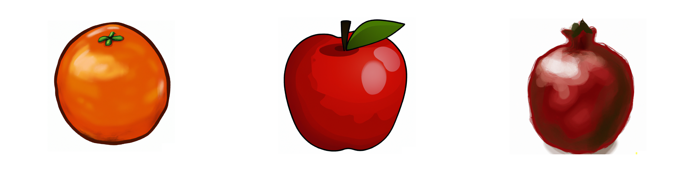
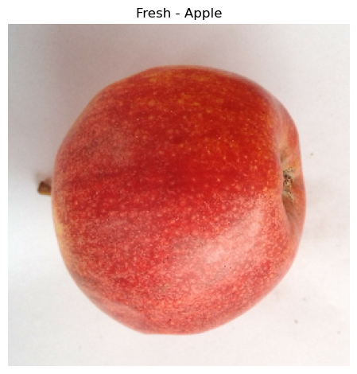
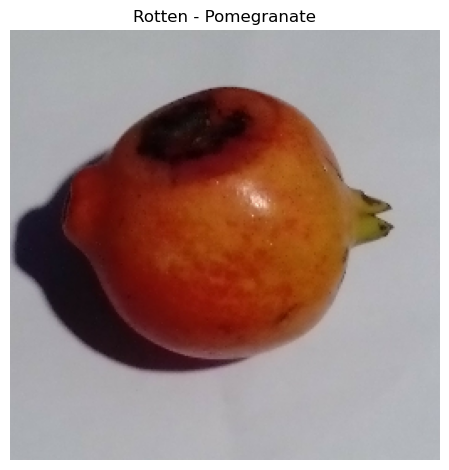
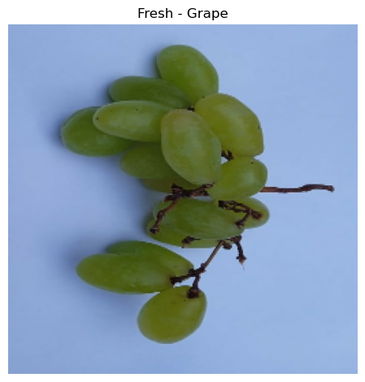
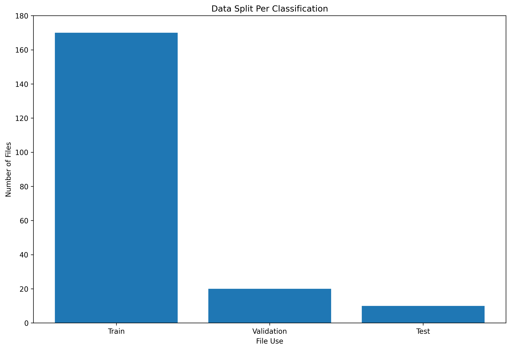
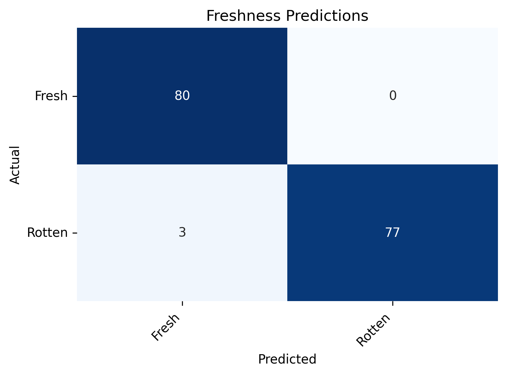
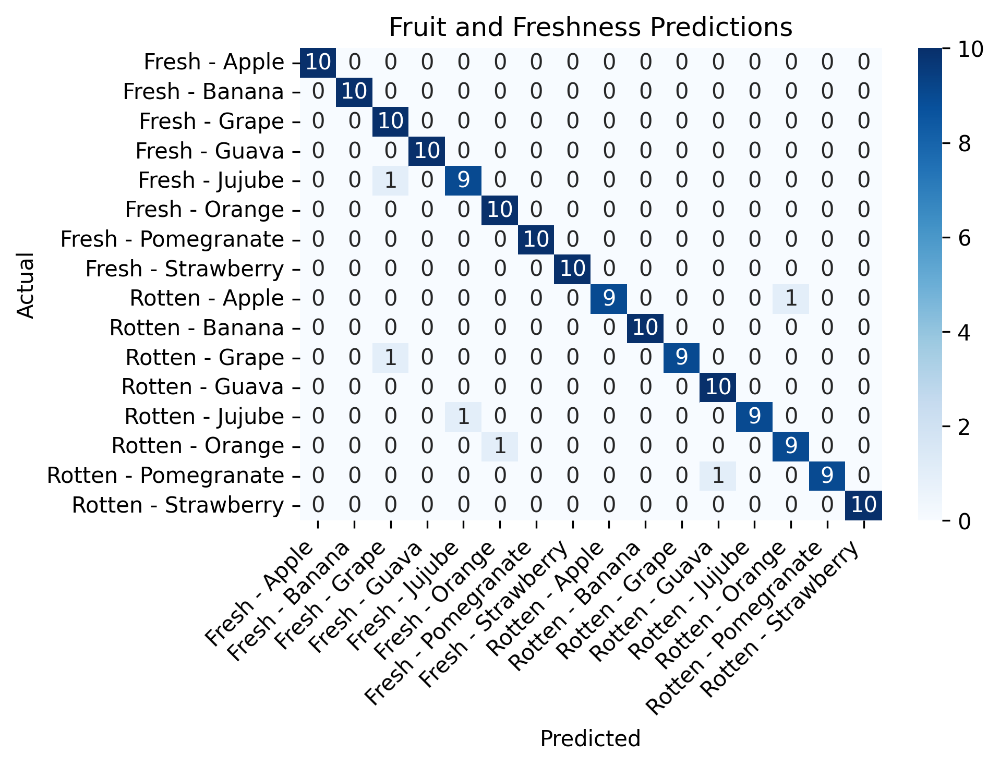
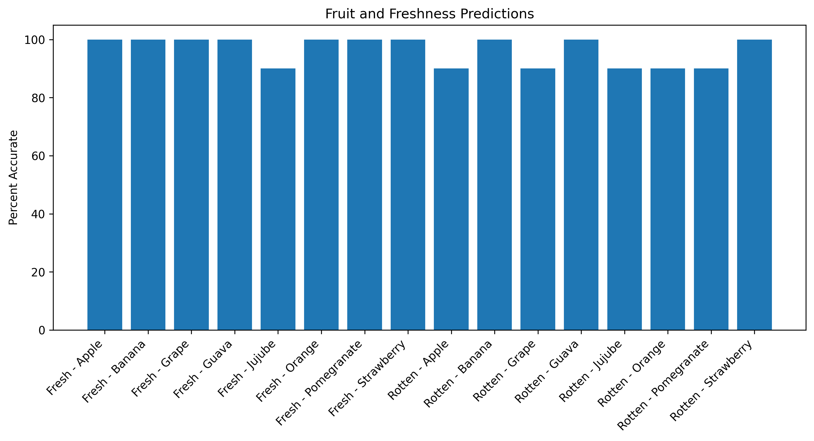

# Fresh or Rotten - CNN for Fruits

# Objectives

My main objective was to create a convolutional neural network image classification model that identifies if a fruit was fresh or rotten, and the type of fruit.

This model can serve as the foundation for achieving two larger objectives:
Saving food focused businesses money, primarily through the reduction of human capital needed to sort rotten food, and
Reducing food waste and the impact it has through greenhouse gas emissions

# Business Understanding

According to a report from the World Wide Fund for Nature and Tesco in 2021, global food waste on farms alone accounted for 15.3% of all food produced globally. Food waste or food loss is revenue loss. Any unit of food not sold by a farm, wholesaler, or retailer is money lost.

While there are many other indirect, and direct factors for food loss, one of the most consistent is human capital. For example, at the farm level growers have left whole fields to rot in order to tend to other fields with what labor was available. Reducing the number of workers needed and the time spent on sorting out rotten fruit allows for workers to put energy towards other tasks.

And food loss happens at all points in the supply chain: harvest, storage, wholesale, retail, and consumer use. At each of these points, effectively screening fruit freshness through automated systems can help release the pressure needed from human capital.

Implementing a CNN model can be used as a tool by food businesses to accomplish this decrease in human labor hours needed and increase efficiency in harvesting, sorting, and selling crops. As mentioned, improving these same systems to save money would also reduce food waste. The UN Environment Programme suggest approximately 9% of global greenhouse gas emissions are associated with food that is not consumed. This means focusing on saving money in this manner, would have the bonus of creating more sustainable systems. This use of machine learning is a win win for businesses and sustainability.

# Data Understanding

The data used for the model is comprised of approximately 2700 original images images of fresh and rotten fruits. These images were provided by Jahangirnagar University School & College, and were divided into sixteen equal classes - Fresh and Rotten classes for eight different fruits: Red Apples, Bananas, Grapes, Guavas, Jujubes, Oranges, Pomegranates, and Strawberries.

It should be noted that “fresh” and “rotten” are subjective terms that change depending on the business use for the crop and the individual. Additionally, the model has been trained on images of both individual fruit, and fruit in bunches for all fruit types. An example can be seen with the bottom images of grapes. This widens the use capability of the model, particularly for crops that are harvested and sold in bunches, such as grapes and bananas. 

Example of original images:

Data was split into training, validation, and testing for modeling. This left 170 original images left for each classification as training data. To help the model, data augmentation was used to created new images from the existing originals.

# Model Performance

When looking at the prediction of just fresh and rotten classification, the model predicted the correct freshness at 98% on the unseen test data. Both of the errors were false negatives, the model predicted the fruit was fresh, when in fact, they were rotten. As a screener for rotten fruit, this is the less desirable error, and an indication that further tuning to the model will be beneficial. The model was able to predict the correct freshness AND fruit 96% (0.9625) of the time. Fresh jujube was the only true fresh classification that had an inaccurate prediction, in this case, as a fresh grape. Collecting more data of original images of each classification in the future will increase the models performance.

# Next Steps

Each food business that will be using the model should add data that fits its purposes. As an example farms should add images of fresh and rotten crops grown at that farm, which could include vegetables. In additional to expanding the classification of crops for that farm, more data will continue to increase the accuracy of the model. This will also fine-tune the model for what that farm considers rotten, (a subjective term).

Some crops may have visible blemishes making them unlikely to be purchased by a consumer at a market or store, but can still be sold to other businesses and used in the creation of other food products. Adding a middle level of freshness classification will allow businesses to maximize product use, increasing revenue and reducing waste further. Another level of freshness classification that could be added at the farm level is unripe. This could be used for crop monitoring to signal when fruit is ready to be harvested.

And lastly, integrate the model for specific business need. From crop monitoring before harvest to sorting freshness via a conveyor belt, each business has a unique need for classification. I look forward to working with them on implementing this model in the best way.

